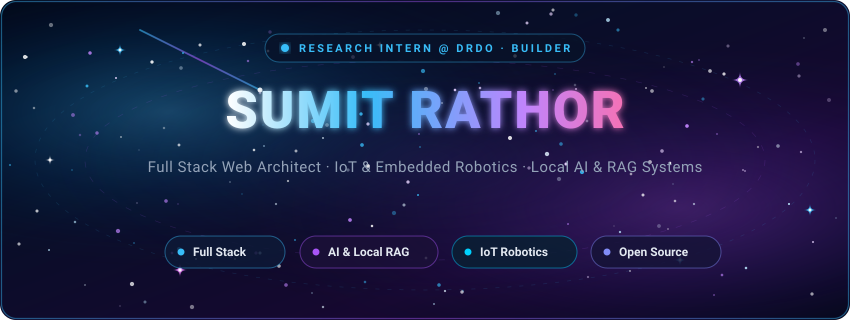

<!-- Cosmic Header Banner (Deep Space & Stars Theme) -->

  

<!-- Cosmic Quick Links Bar -->
&nbsp;
&nbsp;
&nbsp;

 

<!-- Hero Section: Exactly modeled after portfolio website (sumitrathor.rf.gd) -->
<table>
  <tr>
    <td width="58%" valign="middle">
      
        
      <h1>🌌 Hi, I’m Sumit Rathor</h1>
      
<b>Full Stack Developer building web applications, AI-powered tools, and practical solutions with modern web technologies.</b>

      

        
        
        
      

      

        
        
        
      

      

        
        
        
      

    </td>
    <td width="42%" align="center" valign="middle">
      
    </td>
  </tr>
</table>

  

## 👨‍💻 About Me

- 🎓 **Academic Journey:** Pursuing **B.Tech in Computer Science & Design** at **Madhav Institute of Technology and Science (MITS), Gwalior** (2024–2027); previously completed **Diploma in Computer Science & Engineering** from Dr. B.R. Ambedkar Polytechnic College (2021–2024).
- 🔬 **Research & Practice:** **Research Intern at DRDO – CFEES (Delhi)**, developing an offline Retrieval-Augmented Generation (RAG) system for technical document retrieval with local LLMs.
- 🛠️ **Engineering Mindset:** I build practical solutions from the ground up—ranging from database-backed student utilities and real-time audio players to microcontrollers and autonomous camera vehicles.
- 👥 **Leadership & Community:** **President** of the **Innovation & DIY Club** at MITS Gwalior; led overall event management as **Event Coordinator** for the **Techfest IIT Bombay Zonal Workshop**.
- 🌐 **Open Source:** Passionate open-source maintainer; served as **Project Admin** in **GSSoC'25** and **ECWoC'26** (ranked in the Top 20 Project Admins).

  

## 🚀 What I Work On

<table>
  <tr>
    <td width="50%" valign="top">
      <h3>🌐 Full-Stack Web Applications</h3>
      
Building responsive, database-backed web platforms, APIs, and student portals using <b>PHP, CodeIgniter 4, MySQL, JavaScript (ES6+)</b>, and <b>Bootstrap 5</b>, with clean state handling and RESTful endpoints.

    </td>
    <td width="50%" valign="top">
      <h3>🤖 AI & Intelligent Systems</h3>
      
Architecting offline, privacy-focused <b>Retrieval-Augmented Generation (RAG)</b> pipelines with <b>LangChain, ChromaDB, and Ollama (Llama 3.2)</b>, alongside computer vision models using <b>OpenCV</b> and <b>MediaPipe</b>.

    </td>
  </tr>
  <tr>
    <td width="50%" valign="top">
      <h3>🏎️ IoT & Embedded Systems</h3>
      
Interfacing microcontrollers (<b>ESP32-CAM, Arduino UNO</b>) with responsive web command dashboards, PWM motor drivers (L298N), real-time camera streaming, and UART serial communication.

    </td>
    <td width="50%" valign="top">
      <h3>⚙️ Automation & Open Source</h3>
      
Configuring automated deployment workflows via <b>GitHub Actions CI/CD</b>, managing open-source contributor teams, and building practical tools to solve everyday student challenges.

    </td>
  </tr>
</table>

  

## 💡 Featured Projects

### 🏡 [NearBy – Student Housing & Campus Services Platform](https://github.com/sumitrathor1/nearby)
> *A community-driven student relocation platform connecting junior students with verified seniors and local service providers to eliminate broker exploitation.*
- **Tech Stack:** `PHP` `MySQL` `JavaScript (ES6+)` `Bootstrap 5` `Gemini AI` `AJAX`
- **Highlights:** Multi-role user dashboards (Students, Property Owners, Local Vendors), campus accommodation search filters, daily essentials directory (tiffin, utilities), and an integrated Gemini AI chatbot assistant.
- **Open Source:** Selected and maintained as an official project for **ECWoC'26** (30+ forks, multi-student collaboration).
- **Links:** [GitHub Repository](https://github.com/sumitrathor1/nearby) · [Live Demonstration](https://sumitrathor.rf.gd/nearby/)

---

### 🏎️ [FPV Surveillance Car & AI Autonomous Driving System](https://github.com/sumitrathor1/FPV_Car)
> *An end-to-end IoT, robotics, and computer vision platform featuring real-time first-person-view streaming and multi-mode remote control.*
- **Tech Stack:** `ESP32-CAM` `Arduino UNO` `Python (OpenCV)` `PHP` `JavaScript` `L298N`
- **Highlights:** Responsive web command center with virtual joysticks and speed telemetry, HTTP camera streaming, UART serial motor bridging, and an autonomous obstacle-avoidance worker bot written in Python.
- **Links:** [GitHub Repository](https://github.com/sumitrathor1/FPV_Car) · [Web Dashboard & Docs](https://sumitrathor.rf.gd/FPV_Car/)

---

### 🔒 [Rakshak AI – Enterprise Local RAG Knowledge Assistant](https://github.com/sumitrathor1/Rakshak-AI)
> *A completely offline, privacy-first Retrieval-Augmented Generation (RAG) system running entirely on local architecture.*
- **Tech Stack:** `Python` `LangChain` `ChromaDB` `Ollama (Llama 3.2, nomic-embed-text)` `Streamlit`
- **Highlights:** Local PDF knowledge-base ingestion, chunked vector persistence in ChromaDB, automated Ollama daemon health monitoring, and hallucination-resistant technical document Q&A without any third-party API exposure.
- **Links:** [GitHub Repository](https://github.com/sumitrathor1/Rakshak-AI)

---

### 🎵 [VibeTune – Lightweight Web Music Streaming Application](https://github.com/sumitrathor1/VibeTune)
> *A responsive, browser-based music streaming player built with procedural PHP, AJAX, and MySQL.*
- **Tech Stack:** `JavaScript (Vanilla)` `PHP` `MySQL` `HTML5/CSS3` `AJAX`
- **Highlights:** In-browser audio playback without page refreshes, MP3 upload pipeline with album art extraction, custom playlist management, favorite tracks, and RapidAPI integration.
- **Links:** [GitHub Repository](https://github.com/sumitrathor1/VibeTune) · [Live Demonstration](https://sumitrathor.rf.gd/VibeTune/)

---

### 📊 [Data Science Quiz & Assessment Platform](https://github.com/sumitrathor1/Data-Science-Quiz)
> *An interactive skill evaluation engine designed for students and educators with automated analytics.*
- **Tech Stack:** `PHP 8.x` `MySQL` `JavaScript` `Bootstrap` `GitHub Actions`
- **Highlights:** Timed topic-wise quizzes (Python, Statistics, Machine Learning), immediate score calculation with detailed solution explanations, student attempt history, and an administrative question-bank manager with CI/CD deployment.
- **Links:** [GitHub Repository](https://github.com/sumitrathor1/Data-Science-Quiz) · [Live Demonstration](https://sumitrathor.rf.gd/Data-Science-Quiz/)

---

### 🔗 [BitBrief – High-Efficiency Database-Backed URL Shortener](https://github.com/sumitrathor1/bitBrief)
> *A fast, duplicate-resistant URL shortening service with automated GitHub Actions FTP deployment.*
- **Tech Stack:** `PHP` `MySQL` `Bootstrap 5` `GitHub Actions`
- **Highlights:** Instant lookup cache preventing duplicate records, clean redirect routing, responsive one-page UI, one-click copy, and fully automated FTP CI/CD pipeline.
- **Links:** [GitHub Repository](https://github.com/sumitrathor1/bitBrief) · [Live Demonstration](https://sumitrathor.rf.gd/bitBrief/)

  

## 🛠️ Tech Stack

### Languages

### Web & Backend Development

### AI, Computer Vision & IoT Hardware

### Tools & Platforms

  

## 💻 Competitive Programming & Problem Solving

I regularly practice algorithmic problem solving to sharpen my understanding of Data Structures, Algorithms, and computational complexity.

- **Core Topics:** Dynamic Programming, Graph Theory, Trees, Arrays & Strings, and Object-Oriented Design.
- **Problem Solving Record:** 300+ problems solved across competitive coding platforms.

  

## 🏆 Experience & Technical Involvement

- 🔬 **Research Intern** · **DRDO – CFEES (Delhi)** *(June 2026 – Present)*
  - Developing an enterprise local Retrieval-Augmented Generation (RAG) assistant for querying and retrieving information from classified technical documents.
  - Designing local vector retrieval pipelines using LangChain, ChromaDB, and local LLMs (Ollama / Llama 3.2) to deliver fast, private document synthesis.
- 🏢 **Freelance Full Stack Developer** · **11AcreAI** *(March 2026 – May 2026)*
  - Developed end-to-end features for a real estate listing and property brokerage platform.
  - Implemented dynamic listing catalogs, advanced search filters, and authentication using PHP, CodeIgniter 4, MySQL, and JavaScript.
- 🌐 **Web Developer Intern** · **Coders Cafe Club** *(March 2024 – August 2024)*
  - Built and maintained the college technical club web portal using PHP, MySQL, JavaScript, and Bootstrap.
- ⚡ **President** · **Innovation & DIY Club, MITS Gwalior**
  - Leading a technical community of 50+ student engineers across Web Development, IoT, Embedded Systems, and Project R&D.
  - Mentoring junior developers, hosting hands-on workshops, and reviewing project deliverables.
- 🎯 **Overall Event Coordinator** · **Techfest IIT Bombay Zonal Workshop**
  - Managed overall event coordination, stage operations, and participant management for the Techfest IIT Bombay Zonal Workshop at MITS-DU.
- 🚀 **Open Source Project Admin** · **GSSoC'25 & ECWoC'26**
  - Maintained open-source repositories (*NearBy*, *Sachiva*); reviewed and merged pull requests, authored contribution guidelines, and mentored dozens of developers.
  - Ranked among the **Top 20 Project Admins** in ECWoC'26; received an official Letter of Recommendation (LOR) from GSSoC'25.
- ☁️ **Google Cloud Arcade Legend** *(Phase 1, 2025)*
  - Completed hands-on cloud labs covering computing, storage, and infrastructure milestones.

  

## 📚 What I'm Currently Exploring

- ⚛️ **Modern Frontend Architectures:** Deepening component design patterns, modular state management, and React performance.
- 🧠 **Agentic Workflows & Multi-Modal RAG:** Experimenting with advanced semantic chunking, embedding fine-tuning, and multi-agent reasoning.
- 🏗️ **Scalable System Design:** Studying caching mechanisms, relational schema optimization, and microservice communication.
- 📡 **Embedded IoT Protocols:** Exploring lightweight wireless communication and telemetry streaming for autonomous hardware.

  

## 📊 GitHub Analytics

  
  

  
  

  

## 📬 Let's Connect

I am always interested in discussing new technology, collaborating on impactful open-source projects, and exploring full-stack or software engineering opportunities.

 

<i>🌌 Designed with cosmic precision for recruiters, collaborators, and builders.</i>

